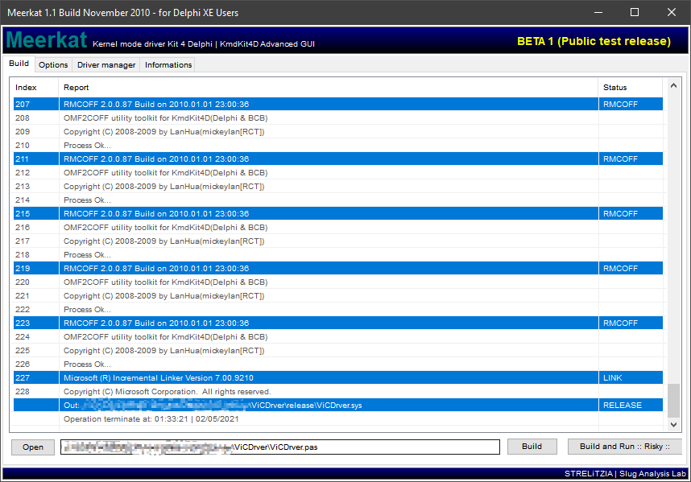
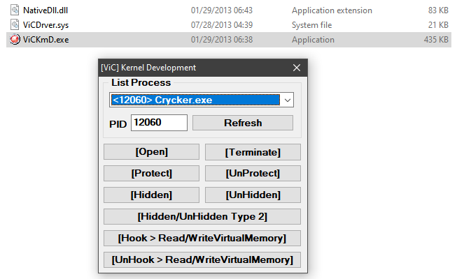

### Vic Driver for DELPHI ###
_ _ _

Vic Driver - The Kernel Mode Driver that written in Delphi in ~2012. It is an useful driver and has the highest privilege level on the Windows platform. It can be used for Game Hacking and others.

##### INSTALLATION #####

> Using [Meerkat 1.1 2010 STRELiTZIA Slug Analysis Lab](<https://www.kernelmode.info/forum/viewtopic0e56.html?f=14&t=465>) driver toolkit to build this kernel driver project.
>
> [DOWNLOAD HERE](Others/KMDKIT.zip)

##### FEATURES #####

##### REFERENCE

> *SEH for DELPHI at <https://github.com/vic4key/SEH-For-DELPHI>*

_ _ _

Website: https://vic.onl/